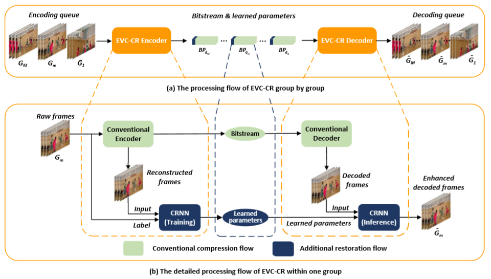

# EVC-CR: An Enhanced Video Compression Framework with a Content-fitted Restoration Neural Network 

Our enhanced video compression framework called EVC-CR which combine a conventional codec and a content-fitted restoration neural network (CRNN). In an encoder, CRNN is trained online with the reconstructed frames from a conventional encoder as the input and the raw frames as the ground truth. The content-fitting is realized by training it only with a group of consecutive frames. The content-fitted parameters of CRNN are transmitted as a part of an encoded bitstream. In a decoder, with the transmitted parameters, an inference operation of CRNN is performed on the decoded frames to generate the final result.


## Dependencies and Installation
* pytorch >= 1.0
* ffmpeg

## Experiment process
The experiment is divided into two processes, conventional encode and content-fitted restoration.
### conventional encode
We tried five conventional codec, including HM, x264, x265, NVENC, VTM. The conventional encoded bitstream and decoder are in folder data. We can decode these bitstream to get reconstruction data.


We provide a sequence BQTerrace [google]including the original version and compressed version by HM to verify the effectiveness of our method. You also can use your own data to verify it.


### Content-fitted restoration neural network
Testing the content-fitted sequence by the saved checkpoint:

```
python run.py -g 1 evaluate  -m CRNN -b 2 -c 16 -v BQTerrace_1920x1080_60    -q 37 --height 1080 --width 1920 --frame_num 500 --start_frame 0 --codec_mode RA --ckpt ./checkpoints/BQTerrace_1920x1080_60_QP37.pth
```

You also can encode and train the compressed video with the following command:

```
python run.py -g 1 train  -m CRNN -b 2 -c 16 -v BQTerrace_1920x1080_60    -q 37 --height 1080 --width 1920 --frame_num 500 --start_frame 0 --neighbor_frames 2 --max_epoch 200 --lr 0.001 --codec_mode RA
```


## Contact
You can contact Lei Li by sending mail to leili_lee@163.com