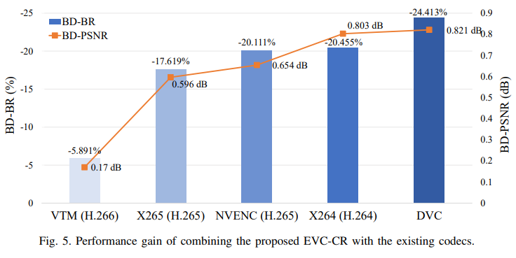

# EVC-CR: An Enhanced Video Compression Framework with a Content-fitted Restoration Neural Network 

## Abstract

Our enhanced video compression framework called EVC-CR which combine a conventional codec and a content-fitted restoration neural network (CRNN). In an encoder, CRNN is trained online with the reconstructed frames from a conventional encoder as the input and the raw frames as the ground truth. The content-fitting is realized by training it only with a group of consecutive frames. The content-fitted parameters of CRNN are transmitted as a part of an encoded bitstream. In a decoder, with the transmitted parameters, an inference operation of CRNN is performed on the decoded frames to generate the final result.


## Results

The following figure shows the performance gain of combining the proposed EVC-CR with the existing codecs. Experimental results show that the compression performance can be greatly improved in terms
of 5.891% - 24.413% BD-BR reduction, by integrating CRNN with VTM, HM, X265, X264, and the end-to-end DNN codec DVC. 




## Dependencies and Installation

* pytorch >= 1.0

  

## Experiment Process
The experiment is divided into two processes, conventional encode and content-fitted restoration.
### Conventional Encode

We tried five conventional codecs and an end-to-end deep video compression framework, including HM, x264, x265, NVENC, VTM, and DVC. 


We provide a sequence *BQTerrace* including the original version and compressed version by HM to verify the effectiveness of our method. The data is available at [Google Drive](https://drive.google.com/drive/folders/1-Fcm4ZqyXk4aJgjwwo51HoSQVzvfrJPS?usp=sharing). You also can use your own data to verify it.


### Content-fitted Restoration Neural Network

Testing the content-fitted sequence by the saved checkpoint:

```
python run.py -g 1 evaluate  -m CRNN -b 2 -c 16 -v BQTerrace_1920x1080_60 -q 37 --height 1080 --width 1920 --frame_num 500 --start_frame 0 --codec_mode RA --ckpt ./checkpoints/BQTerrace_1920x1080_60_QP37.pth
```

You also can encode and train the compressed video with the following command:

```
python run.py -g 1 train  -m CRNN -b 2 -c 16 -v BQTerrace_1920x1080_60 -q 37 --height 1080 --width 1920 --frame_num 500 --start_frame 0 --neighbor_frames 2 --max_epoch 200 --lr 0.001 --codec_mode RA
```


## Contact

You can contact Lei Li by sending mail to leili_lee@163.com